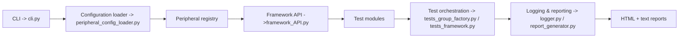
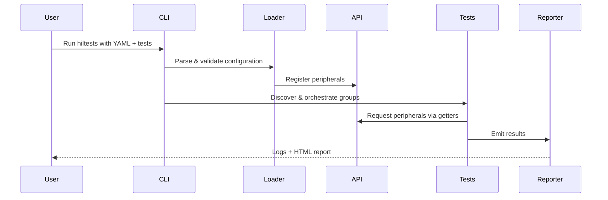

# System Architecture & Extensibility Guide

This document provides a high-level architectural overview of Py-Micro-HIL, the
execution lifecycle of a test run, and the contracts that allow contributors to
extend the framework while keeping it maintainable.

## Architectural overview

Py-Micro-HIL follows a thin, layered design to decouple configuration parsing,
peripheral instantiation, test execution, and reporting:

1. **CLI** (`src/py_micro_hil/cli.py`)
   - Parses command-line flags (paths, verbosity, report options).
   - Resolves report destinations (text log + HTML) and prepares the logging
     pipeline.
   - Invokes the test framework entrypoint with the loaded configuration and
     selected test modules.
2. **Configuration loader** (`peripheral_config_loader.py`)
   - Reads YAML, validates schema, and instantiates peripheral drivers.
   - Supports **real** hardware drivers (GPIO, PWM, UART, I²C, SPI, Modbus RTU)
     or **dummy** drivers for host-only simulation.
   - Registers constructed peripherals in a central registry and exposes them
     via the public API.
3. **Framework API** (`framework_API.py`)
   - Provides getter functions (`get_gpio()`, `get_pwm()`, `get_i2c()`, etc.)
     used by tests to access configured peripherals without importing drivers
     directly.
   - Handles lazy initialization rules and ensures consistent teardown.
4. **Test orchestration** (`tests_group_factory.py`, `tests_framework.py`)
   - Discovers Python modules, wraps them into executable groups with shared
     context, and coordinates setup/teardown hooks.
   - Executes groups, records pass/fail/exception details, and aggregates
     results for reporting.
5. **Logging and reporting** (`logger.py`, `report_generator.py`)
   - Streams console output, writes structured text logs, and renders HTML
     reports (including `styles.css`).
   - Captures metadata such as start/end timestamps, per-test outcomes, and
     any framework/runtime warnings.

### Execution lifecycle

1. User invokes `hiltests` (or `python -m py_micro_hil.cli`) with a YAML config
   and test path arguments.
2. CLI resolves output paths and initializes the logging pipeline.
3. Configuration loader parses YAML, validates schema, instantiates peripherals,
   and registers them with the API.
4. Test groups are built and executed; each test accesses peripherals through
   the API, never directly via driver classes.
5. Results are streamed to logs; at completion the report generator renders
   HTML/text artifacts and performs cleanup of peripherals.

### Deployment modes

- **Hardware mode (e.g., Raspberry Pi):** uses real drivers; requires device
  access and peripheral libraries available on the target OS.
- **Dummy mode (host simulation):** uses stubbed drivers for development and CI;
  no hardware access required, enabling reproducible unit/integration tests on
  any workstation or CI runner.

## Configuration model

A complete YAML schema is described in
[`hardware-configuration.md`](hardware-configuration.md). Key principles:

- **Schema validation:** every section should define required fields, defaults,
  units, and value ranges. Loader should emit clear, actionable error messages
  and refuse to continue on malformed input.
- **Versioning:** treat breaking schema changes as major-version events; provide
  upgrade notes and optional migration helpers for older files.
- **Extensibility:** new peripheral blocks should include a `type` discriminator
  and a `settings` payload so the loader can route instantiation cleanly.

## Public API surface

Tests interact with peripherals exclusively through getters in
`framework_API.py`. Document each getter with signature, expected return type,
and side effects:

- `get_gpio(pin: int)` → configured GPIO driver instance
- `get_pwm(channel: str)` → PWM driver
- `get_uart(name: str)` → UART driver
- `get_i2c(name: str)` → I²C driver
- `get_spi(name: str)` → SPI driver
- `get_modbus(name: str)` → Modbus RTU driver

Best practices for API stability:

- Keep backwards compatibility for getter names and return contracts.
- Surface well-defined exceptions for missing peripherals or invalid states;
  avoid returning `None` silently.
- Avoid leaking driver-specific internals; tests should rely on documented
  methods only.

## Extending the framework

### Adding a new peripheral type

1. **Driver implementation:** add a class under `src/py_micro_hil/peripherals/`
   with `initialize()` and `release()` plus protocol-specific methods. Provide
   dummy-mode behavior if feasible.
2. **Loader integration:** extend `peripheral_config_loader.py` to parse the new
   YAML block, validate the schema, and construct the driver with defaults and
   helpful error messages.
3. **API exposure:** add a getter in `framework_API.py` that retrieves the
   instantiated driver from the registry, validates existence, and documents
   exceptions thrown for missing/misconfigured peripherals.
4. **Documentation and examples:** update
   `hardware-configuration.md` and `writing-tests.md` with a minimal configuration
   and usage snippet; add an example test under `example/hil_tests/`.
5. **Tests:** create unit/integration coverage for loader parsing and dummy-mode
   behavior to protect CI usage.

### Evolving the CLI

- Extend `parse_args()` in `cli.py` with new flags; keep defaults conservative
  and log inferred behavior so users understand side effects.
- Update `running-tests.md` with examples for new options and CI invocations.
- Add regression tests to ensure new flags interact correctly with existing
  defaults and report generation.

### Reporting pipeline

- Keep `Logger` resilient: log (but do not crash) on non-critical I/O failures.
- Preserve report formats (text + HTML) for compatibility; add versioned fields
  if new metadata is introduced.
- Consider accessibility and readability of HTML (`styles.css`) when updating
  layouts.

## Operational guidance

- **CI/CD**: test both dummy mode (unit/integration) and, when hardware runners
  exist, hardware smoke tests. Publish `logs/` and generated HTML to CI
  artifacts; optionally sync `public_html/` for browsing.
- **Security and permissions**: document required device permissions for GPIO,
  UART, SPI, and serial ports. Prefer least-privilege and avoid running as root
  when possible.
- **Performance**: for timing-sensitive protocols, document expected jitter and
  how dummy mode approximates timing so users understand simulation limits.

## Contribution and governance

- Follow the contribution checklist in `developer-guide.md` and add ADR entries
  for significant design changes (new protocols, breaking schema updates, or
  report format modifications).
- Maintain semantic versioning. Breaking changes to drivers, API getters, or
  report formats should trigger a major version bump and an upgrade note in
  `CHANGELOG.md` (create if absent).
- Keep documentation and examples synchronized with code changes; every new
  feature should ship with schema docs, usage examples, and tests.
