# Raspberry Pi Peripheral Layer Architecture

This module represents the lowest-level Hardware Abstraction Layer (HAL) for Raspberry Pi peripherals.
It provides unified access to GPIO, PWM, UART, I2C, and SPI, with consistent APIs and optional mock
implementations when running outside a Raspberry Pi environment.

---

## Overview of Layers

### 1. Platform Detection and Mock Injection
The module checks whether it runs on Raspberry Pi.  
If not, it injects mock modules:

- `RPi.GPIO`
- `spidev`
- `smbus2.SMBus`
- `serial`

This ensures the same API works on:
- real Raspberry Pi hardware,
- development machines,
- CI systems.

### 2. Mixins

#### LoggingMixin
Adds:
- logging enable/disable
- internal `_log()` helper

#### ResourceMixin
Enables:
```python
with PeripheralClass() as p:
    ...
```

It calls `.initialize()` on enter and `.release()` on exit.

### 3. Abstract API Interfaces
Each peripheral defines an ABC interface:

- `RPiGPIO_API`
- `RPiPWM_API`
- `RPiUART_API`
- `RPiI2C_API`
- `RPiSPI_API`
- `RPiHardwarePWM_API`

Each interface specifies expected methods (read/write, transfer, etc.)

### 4. Peripheral Implementations
Each hardware class:

- inherits from `LoggingMixin` and `ResourceMixin`
- implements the corresponding API
- provides:
  - `initialize()` / `release()`
  - `get_required_resources()` (pins & ports)
  - `get_initialized_params()` (if applicable)

Classes include:

- `RPiGPIO`
- `RPiPWM`
- `RPiUART`
- `RPiI2C`
- `RPiSPI`
- `RPiHardwarePWM`

### 5. Hardware Pin/Port Mapping
The module defines maps for UART, I2C, SPI pins.  
This allows higher layers to detect pin conflicts or unavailable interfaces.

---

## UART Pin Map
```
/dev/ttyAMA0 → GPIO 14,15  
/dev/ttyS0   → GPIO 14,15  
/dev/ttyAMA1 → GPIO 0,1  
/dev/ttyAMA2 → GPIO 4,5  
/dev/ttyAMA3 → GPIO 8,9  
/dev/ttyAMA4 → GPIO 12,13  
/dev/serial0 → GPIO 14,15  
```

## I2C Pin Map
```
Bus 0 → GPIO 0,1  
Bus 1 → GPIO 2,3  
Bus 3 → GPIO 4,5  
Bus 4 → GPIO 6,7  
Bus 5 → GPIO 12,13  
Bus 6 → GPIO 22,23  
```

## SPI Pin Map
```
SPI0 → MOSI 10, MISO 9, SCLK 11, CE0=8, CE1=7  
SPI1 → MOSI 20, MISO 19, SCLK 21, CE0=18, CE1=17, CE2=16  
SPI2 → MOSI 40, MISO 41, SCLK 42, CE0=43, CE1=44, CE2=45  
```

---

## Architecture Diagram (Mermaid)

```mermaid
classDiagram
    class LoggingMixin {
        -_logger
        -_logging_enabled
        +enable_logging()
        +disable_logging()
        +_log(message, level)
    }

    class ResourceMixin {
        +__enter__()
        +__exit__(exc_type, exc_val, exc_tb)
    }

    class RPiGPIO_API {
        <<interface>>
        +write(pin, value)
        +read(pin)
        +toggle(pin)
        +enable_logging()
        +disable_logging()
    }

    class RPiPWM_API {
        <<interface>>
        +set_duty_cycle(duty)
        +set_frequency(freq)
        +enable_logging()
        +disable_logging()
    }

    class RPiUART_API {
        <<interface>>
        +initialize()
        +send(data)
        +receive(size)
        +readline()
        +release()
    }

    class RPiI2C_API {
        <<interface>>
        +scan()
        +read(addr, reg, len)
        +write(addr, reg, data)
    }

    class RPiSPI_API {
        <<interface>>
        +transfer(data)
        +transfer_bytes(data)
        +write_bytes(data)
        +read_bytes(len)
        +transfer2(data)
    }

    class RPiHardwarePWM_API {
        <<interface>>
        +set_duty_cycle()
        +set_frequency()
    }

    class RPiGPIO
    class RPiPWM
    class RPiUART
    class RPiI2C
    class RPiSPI
    class RPiHardwarePWM

    LoggingMixin <|-- RPiGPIO
    ResourceMixin <|-- RPiGPIO
    RPiGPIO_API <|.. RPiGPIO

    LoggingMixin <|-- RPiPWM
    ResourceMixin <|-- RPiPWM
    RPiPWM_API <|.. RPiPWM

    LoggingMixin <|-- RPiUART
    ResourceMixin <|-- RPiUART
    RPiUART_API <|.. RPiUART

    LoggingMixin <|-- RPiI2C
    ResourceMixin <|-- RPiI2C
    RPiI2C_API <|.. RPiI2C

    LoggingMixin <|-- RPiSPI
    ResourceMixin <|-- RPiSPI
    RPiSPI_API <|.. RPiSPI

    LoggingMixin <|-- RPiHardwarePWM
    ResourceMixin <|-- RPiHardwarePWM
    RPiHardwarePWM_API <|.. RPiHardwarePWM
```



---

## Example Usage

### GPIO

```python
from module import RPiGPIO
import RPi.GPIO as GPIO

pins = {
    17: {"mode": GPIO.OUT, "initial": GPIO.LOW},
    27: {"mode": GPIO.IN},
}

with RPiGPIO(pins) as gpio:
    gpio.write(17, GPIO.HIGH)
    value = gpio.read(27)
```

### I2C

```python
with RPiI2C(bus_number=1) as i2c:
    devices = i2c.scan()
    data = i2c.read(0x48, 0x00, 2)
```

