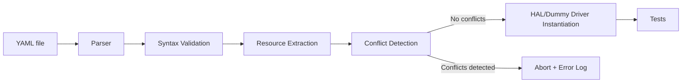
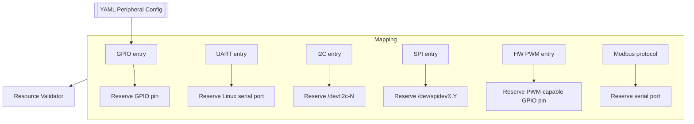
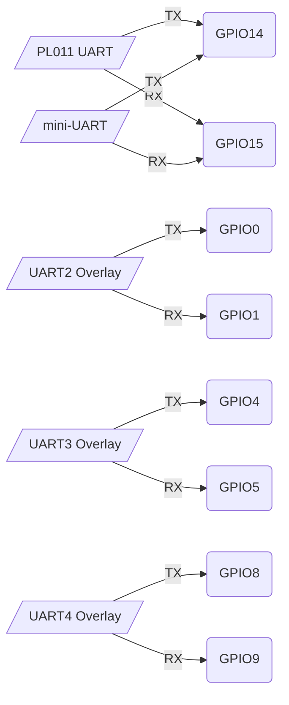
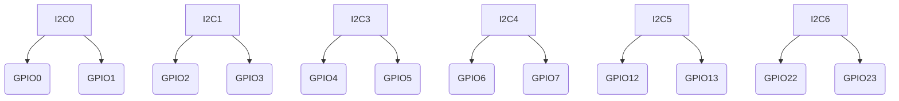
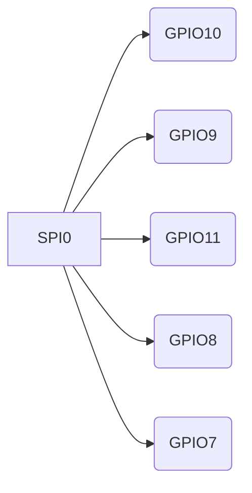

# Hardware Configuration (YAML)

*(Comprehensive reference – fully editable here)*

> This document provides a **complete, exhaustive, practical guide** to hardware configuration in Py‑Micro‑HIL. It explains:
>
> * all supported Raspberry Pi hardware resources (GPIO, PWM, UART, SPI, I²C),
> * what is **enabled by default**, what requires **raspi-config**, and what requires **device‑tree overlays**,
> * full Raspberry Pi **40‑pin header pinouts** for each peripheral,
> * how the YAML schema maps to real hardware,
> * what the framework **validates**, **reserves**, and **never configures automatically**, and
> * concrete YAML **examples for every peripheral**.
>
> It is designed so the user can correctly configure any Raspberry Pi model without needing external documentation.

---

# 1. Overview

Py‑Micro‑HIL loads a single YAML configuration file which declares:

* available **protocol buses** (e.g., Modbus RTU),
* instantiated **hardware peripherals** (GPIO, PWM, hardware PWM, UART, I²C, SPI),
* and all parameters necessary to communicate with them.

The framework then:

* validates the config for **syntax** and **resource conflicts**,
* instantiates platform‑specific drivers (real or dummy),
* and exposes them to test cases.

---

# 2. Important Rules

## ✔ Rule 1 — *The framework NEVER configures Raspberry Pi OS*

Py‑Micro‑HIL **does not**:

* enable interfaces in `raspi-config`,
* modify `/boot/config.txt`,
* load overlays,
* reboot the system.

These steps require user control and may change the stability of the system. Therefore:

> **Users must enable required hardware interfaces before running tests.**

---

## ✔ Rule 2 — *Resources are validated but not auto‑allocated*

The framework validates:

* that declared peripherals reference valid buses/pins/ports,
* that hardware resources do not conflict,
* that parameters are within correct ranges.

It **does not**:

* apply pin muxing,
* remap pins,
* enable inactive controllers.

---

# 3. 40‑pin Header (RPi Models 1–4, Zero, Zero 2)

The header layout is consistent across all boards (GPIO numbering):


### Relevant pins by subsystem

| Function     | Pins                     | Notes                   |
| ------------ | ------------------------ | ----------------------- |
| I²C‑1        | GPIO2 (SDA1), GPIO3 (SCL1) | Enabled by raspi-config |
| SPI0         | GPIO7/8/9/10/11           | CE1/CE0/MISO/MOSI/SCLK  |
| UART0/1      | GPIO14/15                 | Depends on overlay      |
| Hardware PWM | GPIO12,13,18,19           | PWM0/1 channels         |

---

# 4. OS-Level Hardware Activation

## 4.1 Enabled by `raspi-config`

```
I2C  → exposes /dev/i2c-1
SPI  → exposes /dev/spidev0.0 and /dev/spidev0.1
UART → exposes /dev/serial0 (mapping depends on overlays)
```

## 4.2 Enabled only by overlays (`/boot/config.txt`)

You must manually add overlays for:

* extra UARTs (uart1–uart5),
* SPI1 / SPI2 controllers,
* I²C-0 and I²C-3/4/5/6,
* alternate pin mappings.

Example overlay:

```
dtoverlay=uart2
```

This exposes `/dev/ttyAMA2` and assigns TX/RX pins based on the overlay specification.

---

# 5. Resource Types

The framework works with these resource classes:

* **GPIO GPIO pins**,
* **Linux serial ports** (`/dev/serial0`, `/dev/ttyAMA*`, `/dev/ttyUSB*`),
* **I²C device nodes** (`/dev/i2c-*`),
* **SPI device nodes** (`/dev/spidev*.*`).

Conflict detection ensures:

* no two peripherals reserve the same pin,
* no two peripherals reserve the same Linux bus,
* Modbus/UART devices do not share a port,
* SPI devices with same bus+device conflict.

---

# 6. YAML Schema (Summary)

```yaml
protocols:
  modbus: { ... }

peripherals:
  gpio: [ ... ]
  pwm:  [ ... ]
  hardware_pwm: [ ... ]
  uart: { ... }
  i2c:  { ... }
  spi:  { ... }
```

Below: detailed documentation for each section.

---

# 7. GPIO

## 7.1 Schema

| Key       | Type   | Required | Notes                                      |
| --------- | ------ | -------- | ------------------------------------------ |
| `pin`     | int    | yes      | GPIO pin number                             |
| `mode`    | string | yes      | `in` / `out`                               |
| `initial` | string | no       | `low` / `high` for outputs                 |
| `name`    | string | no       | Optional label to reference the pin in API |

## 7.2 Validation

* pin must exist on the header,
* mode must be valid,
* initial only valid when mode=`out`.
* `name` values must be unique when provided; they become reusable symbols for
  the GPIO API.

## 7.3 Resource reservation

* reserves **one GPIO pin**.

## 7.4 Example

```yaml
peripherals:
  gpio:
    - pin: 17
      mode: out
      initial: low
      name: LED_RED
    - pin: 18
      mode: in
      name: PUSHBUTTON
```

---

# 8. Software PWM

## 8.1 Schema

| Key          | Type | Required |
| ------------ | ---- | -------- |
| `pin`        | int  | yes      |
| `frequency`  | int  | yes      |
| `duty_cycle` | int  | no       |

## 8.2 Validation

* frequency > 0,
* duty_cycle within 0–100,
* pin must exist.

## 8.3 Resource reservation

* **one GPIO pin**.

## 8.4 Example

```yaml
peripherals:
  pwm:
    - pin: 12
      frequency: 2000
      duty_cycle: 50
```

---

# 9. Hardware PWM

Hardware PWM pins:

```
GPIO 12, 13, 18, 19
```

## 9.1 Schema

| Key          | Type | Required |
| ------------ | ---- | -------- |
| `pin`        | int  | yes      |
| `frequency`  | int  | yes      |
| `duty_cycle` | int  | no       |

## 9.2 Validation

* pin must be one of {12,13,18,19},
* frequency > 0.

## 9.3 Resource reservation

* **one GPIO pin (fixed PWM channel)**.

## 9.4 Example

```yaml
peripherals:
  hardware_pwm:
    - pin: 13
      frequency: 1000
```

---

# 10. UART

UART interfaces allow serial communication (TX/RX) either via Raspberry Pi internal UART controllers or external USB adapters.

This section now includes:

* full parameter option tables (baudrate, parity, stopbits, timeout),
* available UART interfaces after **raspi-config**, after **overlays**, and on **USB**,
* Raspberry Pi **pin assignments**,
* Linux device names exposed.

## 10.1 UARTs available after OS configuration

### After `raspi-config` (default)

```
serial0 → mapped to mini-UART or ttyAMA0 depending on overlays
serial1 → the remaining UART
```

Typical mapping on Raspberry Pi 3/4:

* `serial0` → **mini-UART** (`/dev/ttyS0`)
* `serial1` → **PL011 UART** (`/dev/ttyAMA0`)

> Note: overlays may swap these.

### After overlays (examples)

```
dtoverlay=uart2 → exposes /dev/ttyAMA1
                → pins GPIO0 (TX), GPIO1 (RX)

dtoverlay=uart3 → exposes /dev/ttyAMA2
                → pins GPIO4 (TX), GPIO5 (RX)

dtoverlay=uart4 → exposes /dev/ttyAMA3
                → pins GPIO8 (TX), GPIO9 (RX)

dtoverlay=uart5 → exposes /dev/ttyAMA4
                → pins GPIO12 (TX), GPIO13 (RX)
```

### External USB UARTs

Always exposed as:

```
/dev/ttyUSB*  (FTDI, CH340, CP2102, etc.)
/dev/ttyACM*  (CDC ACM)
```

USB devices **do not reserve GPIO pins**.

---

## 10.2 Pin usage

| UART controller | Linux device   | TX pin | RX pin | Notes                                       |
| --------------- | -------------- | ------ | ------ | ------------------------------------------- |
| mini-UART       | `/dev/ttyS0`   | GPIO14  | GPIO15  | Enabled by raspi-config                     |
| PL011 (primary) | `/dev/ttyAMA0` | GPIO14  | GPIO15  | Enabled by raspi-config or overlay override |
| uart2           | `/dev/ttyAMA1` | GPIO0   | GPIO1   | Requires overlay                            |
| uart3           | `/dev/ttyAMA2` | GPIO4   | GPIO5   | Requires overlay                            |
| uart4           | `/dev/ttyAMA3` | GPIO8   | GPIO9   | Requires overlay                            |
| uart5           | `/dev/ttyAMA4` | GPIO12  | GPIO13  | Requires overlay                            |
| USB UART        | `/dev/ttyUSB*` | —      | —      | No GPIO usage                               |

---

## 10.3 YAML Schema (expanded)

| Key        | Type   | Default        | Allowed values          | Notes                                  |
| ---------- | ------ | -------------- | ----------------------- | -------------------------------------- |
| `port`     | string | `/dev/ttyUSB0` | any valid serial device | Internal or USB                        |
| `baudrate` | int    | 9600           | any positive integer    | Typical: 9600/19200/38400/57600/115200 |
| `parity`   | string | `N`            | `N`, `E`, `O`           | None/Even/Odd                          |
| `stopbits` | int    | 1              | `1`, `2`                | RTS/CTS optional via overlay           |
| `timeout`  | float  | 1              | ≥0                      | Read timeout in seconds                |

---

## 10.4 Validation rules (expanded)

* port must be a valid serial device name,
* baudrate > 0,
* parity ∈ {N, E, O},
* stopbits ∈ {1, 2},
* timeout ≥ 0.

---

## 10.5 Resource reservation

Peripherals reserve:

* **one serial device** (`/dev/ttyS0`, `/dev/ttyAMA0`, `/dev/ttyUSB*`, ...),
* **no direct pin reservation**, since overlays control this.

---

## 10.6 Examples

```yaml
peripherals:
  uart:
    port: /dev/serial0
    baudrate: 115200
    parity: N
    stopbits: 1
    timeout: 2
```

```yaml
peripherals:
  uart:
    port: /dev/ttyUSB1
    baudrate: 19200
    parity: E
    stopbits: 2
    timeout: 0.5
```

## 10.1 Types of UART devices

### Internal UARTs

Depending on overlays and model:

* `/dev/ttyAMA0` — PL011 UART (full-featured),
* `/dev/ttyS0` — mini-UART,
* `/dev/serial0`, `/dev/serial1` — aliases.

### External UARTs (USB)

* `/dev/ttyUSB*` — FTDI/CH340/etc.,
* `/dev/ttyACM*` — CDC ACM devices.

## 10.2 Schema

| Key        | Type   | Default        |
| ---------- | ------ | -------------- |
| `port`     | string | `/dev/ttyUSB0` |
| `baudrate` | int    | 9600           |
| `parity`   | string | `N`            |
| `stopbits` | int    | 1              |
| `timeout`  | int    | 1              |

## 10.3 Validation

* port must match known UART naming conventions,
* parity ∈ {N,E,O},
* stopbits ∈ {1,2},
* baudrate > 0.

## 10.4 Resource reservation

* reserves **one Linux serial port**.

## 10.5 Example

```yaml
peripherals:
  uart:
    port: /dev/serial0
    baudrate: 115200
    parity: N
    stopbits: 1
    timeout: 2
```

---

# 11. I²C

This section now includes:

* all I²C controllers on GPIO SoC,
* which are enabled by default,
* which appear after overlays,
* which pins are assigned to each bus,
* full parameter option documentation.

## 11.1 Hardware I²C controllers

GPIO SoC supports:

```
I2C0, I2C1, I2C3, I2C4, I2C5, I2C6
```

### After `raspi-config`

```
I2C-1 → always enabled as /dev/i2c-1
Pins: SDA1 = GPIO2, SCL1 = GPIO3
```

### After overlays

```
dtoverlay=i2c0 → /dev/i2c-0, pins GPIO0/GPIO1
dtoverlay=i2c3 → /dev/i2c-3, pins GPIO4/GPIO5
dtoverlay=i2c4 → /dev/i2c-4, pins GPIO6/GPIO7
dtoverlay=i2c5 → /dev/i2c-5, pins GPIO12/GPIO13
dtoverlay=i2c6 → /dev/i2c-6, pins GPIO22/GPIO23
```

### External USB I²C

Appear as:

```
/dev/i2c-10, /dev/i2c-11, ...
```

Bus numbers ≥10 are always safe and conflict-free.

---

## 11.2 Pin usage

| Bus | Linux device       | SDA pin | SCL pin | Enabled by       |
| --- | ------------------ | ------- | ------- | ---------------- |
| 0   | `/dev/i2c-0`       | GPIO0    | GPIO1    | overlay          |
| 1   | `/dev/i2c-1`       | GPIO2    | GPIO3    | raspi-config     |
| 3   | `/dev/i2c-3`       | GPIO4    | GPIO5    | overlay          |
| 4   | `/dev/i2c-4`       | GPIO6    | GPIO7    | overlay          |
| 5   | `/dev/i2c-5`       | GPIO12   | GPIO13   | overlay          |
| 6   | `/dev/i2c-6`       | GPIO22   | GPIO23   | overlay          |
| USB | `/dev/i2c-*` (10+) | —       | —       | external adapter |

---

## 11.3 YAML Schema (expanded)

| Key         | Type | Default | Allowed values             |
| ----------- | ---- | ------- | -------------------------- |
| `bus`       | int  | 1       | 0,1,3,4,5,6 or >=10        |
| `frequency` | int  | 100000  | any >0 (100k/400k typical) |

---

## 11.4 Validation rules

* bus must be valid,
* frequency > 0.

---

## 11.5 Resource reservation

* reserves one **I²C bus device**: `/dev/i2c-N`.
* pin usage is implicit (YAML does NOT specify pins).

---

## 11.6 Examples

```yaml
peripherals:
  i2c:
    bus: 1
    frequency: 400000
```

```yaml
peripherals:
  i2c:
    bus: 10   # USB adapter
    frequency: 100000
```

## 11.1 Hardware I²C buses

GPIO SoC supports:

```
I²C0, I²C1, I²C3, I²C4, I²C5, I²C6
```

Only **I²C‑1** is enabled by default (`raspi-config`).
Other buses appear only after overlays.

## 11.2 External I²C adapters

USB adapters appear as:

```
/dev/i2c-10, /dev/i2c-11, ...
```

## 11.3 Schema

| Key         | Type | Default |
| ----------- | ---- | ------- |
| `bus`       | int  | 1       |
| `frequency` | int  | 100000  |

## 11.4 Validation

* bus ∈ {0,1,3,4,5,6} OR ≥10,
* frequency > 0.

## 11.5 Resource reservation

* reserves **one I²C bus device**.

## 11.6 Example

```yaml
peripherals:
  i2c:
    bus: 1
    frequency: 400000
```

---

# 12. 1-Wire

Py-Micro-HIL supports the Raspberry Pi **1-Wire** interface for DS18B20
temperature sensors via the kernel `w1-gpio` driver.

* The framework automatically detects a loaded kernel 1-Wire bus by scanning
  `/sys/kernel/debug/gpio` for consumers named `w1-gpio` / `w1_gpio` /
  `onewire` and registers an `RPiOneWire` instance using that pin.
* Manual YAML configuration is optional and does **not** accept parameters — the
  bus always maps to **GPIO4**. Use it only to reserve the resource when the
  overlay is not yet active.
* If the kernel overlay is already active on GPIO4, do **not** repeat the
  declaration with logging enabled; the framework will detect the conflict and
  abort configuration to prevent double-registration of the bus.

## 12.1 Activation

Enable 1-Wire via the Raspberry Pi overlay (e.g., `dtoverlay=w1-gpio`). The
framework will discover it automatically; no additional activation is performed
by Py-Micro-HIL.

## 12.2 YAML Schema

```yaml
peripherals:
  onewire: {}
```

The block may also be written as `onewire: true`. No parameters are allowed;
the bus is always on GPIO4.

## 12.3 Validation

* YAML cannot move the bus off GPIO4;
* GPIO4 must not conflict with other peripherals that reserve the pin;
* when a kernel 1-Wire is already active on GPIO4, YAML cannot declare another
  1-Wire instance (configuration stops with a conflict if logging is enabled).

## 12.4 Resource reservation

* reserves **one GPIO pin (GPIO4)**.

## 12.5 Examples

* **Kernel overlay only (preferred):** enable `w1-gpio` in `/boot/config.txt`;
  no YAML block is required because detection is automatic.
* **Explicit YAML declaration:**

  ```yaml
  peripherals:
    onewire:
      pin: 4
  ```

---

# 13. SPI

This section is now extended with:

* all controllers,
* chip-select mapping,
* overlays,
* pin assignments,
* full parameter options.

## 13.1 Hardware SPI controllers

```
SPI0 — enabled via raspi-config
SPI1 — overlay (3 chip selects)
SPI2 — overlay (3 chip selects)
```

### SPI0 pins

| Signal | Pin   |
| ------ | ----- |
| MOSI0  | GPIO10 |
| MISO0  | GPIO9  |
| SCLK0  | GPIO11 |
| CE0    | GPIO8  |
| CE1    | GPIO7  |

### SPI1 (overlay)

Pins vary by overlay, defaults:

* CE0 → GPIO18
* CE1 → GPIO17
* CE2 → GPIO16
* SCLK → GPIO21
* MOSI → GPIO20
* MISO → GPIO19

### SPI2 (overlay)

Pins vary similarly.

---

## 13.2 YAML Schema (expanded)

| Key             | Type  | Default | Allowed values                                |
| --------------- | ----- | ------- | --------------------------------------------- |
| `bus`           | int   | 0       | 0,1,2                                         |
| `device`        | int   | 0       | depends on bus (0/1 for SPI0, 0-2 for SPI1/2) |
| `max_speed_hz`  | int   | 50000   | >0                                            |
| `mode`          | int   | 0       | 0–3                                           |
| `bits_per_word` | int   | 8       | 8,16                                          |
| `cs_high`       | bool  | false   | true/false                                    |
| `lsbfirst`      | bool  | false   | true/false                                    |
| `timeout`       | float | 1       | ≥0                                            |

---

## 13.3 Validation rules

* bus must exist,
* device must be valid for that bus,
* speed > 0,
* mode ∈ {0–3}.

---

## 13.4 Resource reservation

* reserves **/dev/spidevBUS.DEVICE**.

---

## 13.5 Examples

```yaml
peripherals:
  spi:
    bus: 0
    device: 1
    max_speed_hz: 1000000
```

```yaml
peripherals:
  spi:
    bus: 1   # requires overlay
    device: 2
    max_speed_hz: 2000000
    mode: 3
```

## 13.1 Hardware SPI controllers

```
SPI0 — enabled via raspi-config
SPI1, SPI2 — enabled via overlays
```

### SPI0 chip selects

* bus 0, device 0 → CE0
* bus 0, device 1 → CE1

## 13.2 Schema

| Key             | Type  | Default |
| --------------- | ----- | ------- |
| `bus`           | int   | 0       |
| `device`        | int   | 0       |
| `max_speed_hz`  | int   | 50000   |
| `mode`          | int   | 0       |
| `bits_per_word` | int   | 8       |
| `cs_high`       | bool  | false   |
| `lsbfirst`      | bool  | false   |
| `timeout`       | float | 1       |

## 13.3 Validation

* `bus` must reference an existing SPI controller (0,1,2),
* `device` must be a valid chip select for that controller,
* speed > 0,
* mode ∈ {0,1,2,3}.

## 13.4 Resource reservation

* reserves one **SPI device node** (`/dev/spidevX.Y`).

## 13.5 Example

```yaml
peripherals:
  spi:
    bus: 0
    device: 1
    max_speed_hz: 2000000
    mode: 0
    bits_per_word: 8
    timeout: 1
```

---

# 14. Protocols

The `protocols:` section defines **shared communication buses** used by higher-level test logic.
Currently Py-Micro-HIL implements **one protocol**: **Modbus RTU**.

Protocols differ from peripherals:

* they do **not** reserve GPIO pins directly,
* they reserve **ports** (e.g., a serial port for Modbus),
* they represent multi-device buses, not a single peripheral instance.

---

# 14.1 Modbus RTU

Modbus RTU is implemented using `pymodbus` and a serial port (USB or internal UART).
It provides full read/write access to Modbus coils, discrete inputs, holding registers, and input registers.

## 14.1.1 YAML Schema

```yaml
protocols:
  modbus:
    port: /dev/ttyUSB0
    baudrate: 115200
    parity: N
    stopbits: 1
    timeout: 1
```

| Key        | Type   | Default        | Notes                                    |
| ---------- | ------ | -------------- | ---------------------------------------- |
| `port`     | string | `/dev/ttyUSB0` | Any serial device (USB or internal UART) |
| `baudrate` | int    | 9600           | Typical values: 9600/19200/115200        |
| `parity`   | string | `N`            | `N`/`E`/`O`                              |
| `stopbits` | int    | 1              | 1 or 2                                   |
| `timeout`  | float  | 1              | Seconds                                  |

---

## 14.1.2 Validation

* `port` must match UART port conventions (`ttyUSB*`, `ttyACM*`, `serial0`, `ttyAMA*`).
* `baudrate` > 0.
* `parity` ∈ {N, E, O}.
* `stopbits` ∈ {1, 2}.
* `timeout` ≥ 0.

If validation fails → framework logs an error and aborts configuration.

---

## 14.1.3 Resource Reservation

Modbus reserves **one serial port**:

```
{"ports": [self.port]}
```

This ensures that the UART chosen by Modbus cannot be reused by `peripherals.uart`.

---

## 14.1.4 Behavior

* `initialize()` opens a connection using `pymodbus`.
* `release()` closes the connection.

All Modbus methods wrap the corresponding functions from `pymodbus.client.ModbusSerialClient`:

* `read_holding_registers()`
* `write_single_register()`
* `write_multiple_registers()`
* `read_coils()`
* `write_single_coil()`
* `write_multiple_coils()`
* `read_discrete_inputs()`
* `read_input_registers()`

Any Modbus error is raised as an exception.

---

## 14.1.5 Example Usage in Tests

```python
modbus = framework.get_modbus()

values = modbus.read_holding_registers(slave_address=1, address=0, count=4)
modbus.write_single_register(slave_address=1, address=10, value=123)
```

---

# 15. Summary Diagram – Resource Flow

```
YAML → Parser → Validation → Resource Reservation → HAL/Dummy Driver → Tests
```

```
+------------+     +-----------+     +----------------+     +-------------+
| YAML file  | --> | Validator | --> | Resource Map   | --> | HAL Drivers |
+------------+     +-----------+     +----------------+     +-------------+
                                          | GPIO pins
                                          | Serial ports
                                          | SPI/I2C buses
```

---

# 16. Global Raspberry Pi Peripheral Matrix

This section provides a consolidated overview of all Raspberry Pi models supported by Py‑Micro‑HIL and the hardware resources available on each.

## 16.1 Peripheral Availability by Raspberry Pi Model

| Feature           | Pi Zero / Zero 2 | Pi 3B/3B+   | Pi 4B       | CM4                | Notes                             |
| ----------------- | ---------------- | ----------- | ----------- | ------------------ | --------------------------------- |
| GPIO pins         | 0–27             | 0–27        | 0–27        | depends on carrier | All models share identical pinout |
| UART0 (PL011)     | ✔                | ✔           | ✔           | ✔                  | May be mapped to serial0/serial1  |
| mini-UART         | ✔                | ✔           | ✔           | ✔                  | Lower timing stability            |
| Extra UARTs (1–5) | overlay          | overlay     | overlay     | overlay            | Requires dtoverlay=uartX          |
| I²C-1             | ✔                | ✔           | ✔           | ✔                  | Enabled via raspi-config          |
| I²C-0             | overlay          | overlay     | overlay     | overlay            | Often camera EEPROM               |
| I²C 3–6           | overlay          | overlay     | overlay     | overlay            | All optional                      |
| SPI0              | ✔                | ✔           | ✔           | ✔                  | MOSI/MISO/SCLK/CE0/CE1            |
| SPI1/SPI2         | overlay          | overlay     | overlay     | overlay            | Up to 3 chip selects each         |
| HW PWM            | 12/13/18/19      | 12/13/18/19 | 12/13/18/19 | varies             | RPi5 differs                      |

---

# 17. Resource Activation Flowcharts

This section provides clear flow diagrams showing how Py-Micro‑HIL processes YAML, validates configuration, and maps resources.

## 17.1 End‑to‑End Configuration Flow



---

## 17.2 Peripheral Resource Mapping



---

# 18. Pin Mapping Charts

## 18.1 UART Pin Mapping (Internal UARTs)



---

## 18.2 I²C Bus Mapping



---

## 18.3 SPI0 Mapping



---

# 19. Expanded Examples

## 19.1 Full YAML Example Combining All Subsystems

```yaml
protocols:
  modbus:
    port: /dev/ttyUSB0
    baudrate: 115200
    parity: N
    stopbits: 1
    timeout: 2

peripherals:
  gpio:
    - pin: 17
      mode: out
      initial: low
    - pin: 23
      mode: in

  pwm:
    - pin: 12
      frequency: 2000
      duty_cycle: 50

  hardware_pwm:
    - pin: 18
      frequency: 1000

  uart:
    port: /dev/serial0
    baudrate: 115200
    parity: N
    stopbits: 1
    timeout: 1

  i2c:
    bus: 1
    frequency: 400000

  spi:
    bus: 0
    device: 1
    max_speed_hz: 2000000
    mode: 0
    bits_per_word: 8
    timeout: 1
```

---

# 20. Summary

* Peripherals and protocols now have **complete option tables**.
* All subsystems document **default availability**, **overlay activation**, and **Linux devices**.
* Pinouts are rendered visually.
* Resource mapping and initialization are shown using flowcharts.
* Users can now fully understand **what is available**, **what must be enabled**, and **how YAML maps to real hardware**.

This completes the extended documentation for hardware configuration.

* Peripherals reserve **pins or buses**.
* Protocols reserve **ports**.
* Overlays and raspi-config must be enabled manually.
* YAML defines desired configuration; the framework guarantees correctness.

This file should now fully describe **everything a user needs** to configure Py-Micro-HIL hardware correctly.